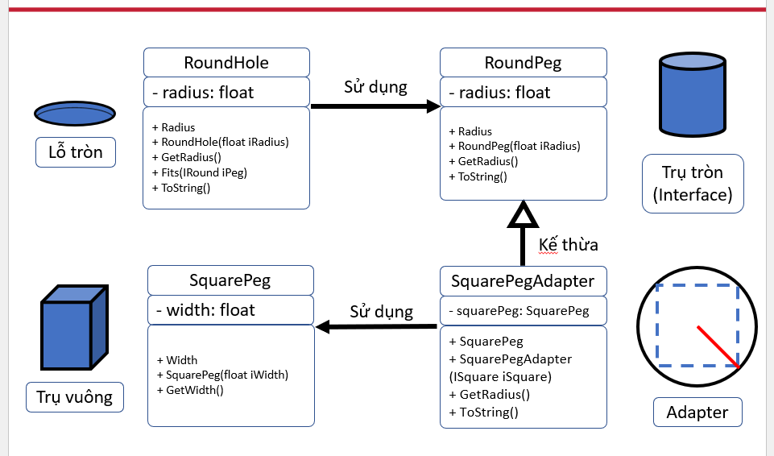
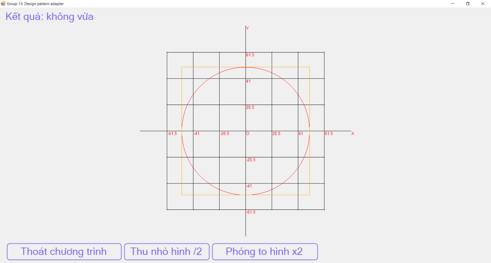

# Bài toán: So sánh kích thước của hình tròn và hình vuông

# Công nghệ

- Sử dụng Windows Forms C#
- Áp dụng Coding Convention
- Sử dụng Design Patterns (Adapter Pattern)

# Giao diện người dùng

